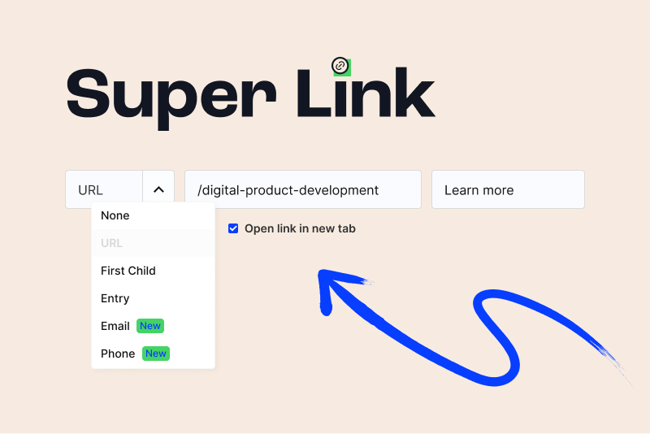

<!-- statamic:hide -->




<!-- /statamic:hide -->

# Super Link

A fieldtype to create smarter links in Statamic 4+

## Features

- **Link text customization:** Seamlessly add link text directly within the link field.
- **Additional link types:** Enhance your links with phone and email options, in addition to Statamic's default types.
- **Open in new tab:** Choose whether to open links in a new tab for an improved user experience.
- **Seamless integration:** Simply add the Super Link fieldtype to your blueprints like any other link field.

## Installation

Require it using Composer.

```bash
composer require superinteractive/statamic-super-link
```

## Usage

Once installed, the Super Link fieldtype becomes available when you configure your blueprints.

To display the link in your Antlers template:

```html
{{ super_link }}
  <a href="{{ url }}" target="{{ target }}">{{ text }}</a>
{{ /super_link }}
```

Or

```html
<a href="{{ super_link.url }}" target="{{ super_link.target }}">{{ super_link.text }}</a>
```

## Editor Options

- **Link Type:**
  - **URL**: Enter or paste any valid URL.
  - **First Child**: Dynamically return the URL to first entry nested below in a Structure or Navigation.
  - **Entry**: Directly link to any entry in your Statamic site.
  - **Email**: Enter an email address to create a `mailto:` link.
  - **Phone**: Enter a phone number to create a `tel:` link.
- **Link Text**: Customize the link's display text.
- **Open in New Tab**: Toggle to specify whether the link should open in a new tab.

## Support

For support, issues, or feature requests, visit the our [GitHub issues page](https://github.com/superinteractive/statamic-super-link).

## License

The MIT License (MIT). Please see [License File](https://github.com/superinteractive/statamic-super-link/blob/main/LICENSE.md) for more information.
